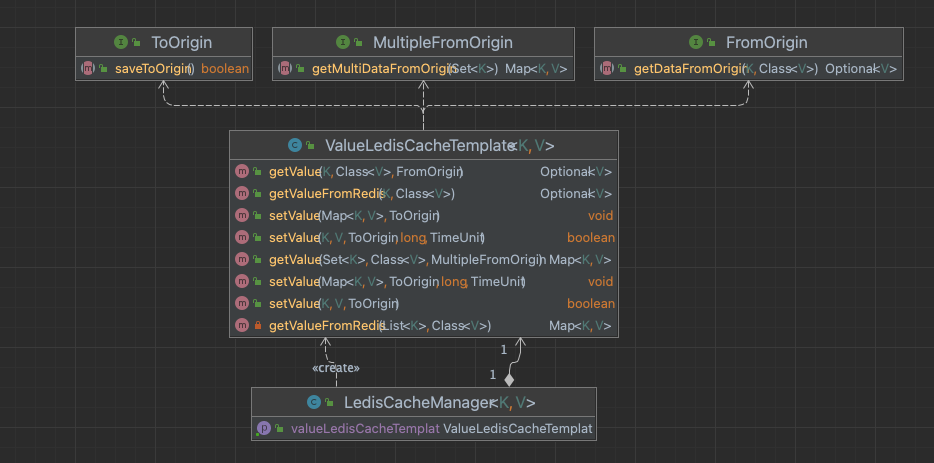

# ledis-cache
- `L`ee KyeongHoon이 만든 R`edis Cache` 라이브러리
- Look Aside Cache를 구현할 때 공통적으로 사용되는 부분을 라이브러리로 만들었습니다.
- RedisTemplate으로 Cache기능을 쉽게 구현할 수 있도록 합니다.
- 사용자는 `Key`와 `원본 Repository에서 데이터를 조회하는 기능`에만 집중할 수 있습니다.
- `{root-directory}/build/libs/LedisCache-0.0.2.jar`를 사용하면 됩니다.

## 주요 사항
- Manager class를 만들어서 불필요한 인스턴스 생성을 방지했습니다.
- 사용할 RedisTemplate은 의존성을 주입받도록 하여 결합도를 낮추었습니다.
- Redis Cache로부터 데이터를 조회하는 기능과 저장하는 기능을 추상화하여 사용자가 원하는대로 Custom 하여 사용할 수 있도록 했습니다.
- 캐싱할 때 사용하는 key 와 value의 타입이 사용자마다 다를 수 있다는 점을 고민했습니다.
> 1.Generic을 이용해 사용자가 원하는 타입을 사용할 수 있도록 했습니다.
```java
public class ValueLedisCacheTemplate<K, V> {
//   중략 ... 
}
```
> 2.어떤 타입이 들어와도 사용할 수 있도록 key, value를 Json으로 변환하였습니다.
```java
result = Optional.ofNullable(objectMapper.readValue(optionalStringResult.get(), valueClass));
```
- javadoc을 신경써서 작성하여 사용자의 편의를 도모했습니다.
## Class Diagram



#### Interfaces
- ToOrigin : 원본 저장소에 데이터를 저장하는 기능을 추상화한 Interface
- MultipleFromOrigin : 원본저장소에서 여러 개의 데이터를 조회하는 기능을 추상화한 Interface
- FromOrigin : 원본저장소에서 단일 데이터를 조회하는 기능을 추상화한 인터페이스

#### Classes
- LedisCacheManager : CacheTemplate 인스턴스를 필요이상으로 생성하지 않도록 관리하는 역할을 수행하는 Class
- ValueLedisCacheTemplate : Redis의 String을 이용한 캐싱 기능을 제공하는 Class

## javadoc 링크
- [javadoc ](https://pongdangx2.github.io/ledis-cache/)

## Spring 에서 공통코드를 캐싱하는 예시

### 1. 설정
- LedisCacheManager Bean을 등록합니다. 
- 이 때, 미리 만들어진 RedisTemplate Bean과 의존관계를 설정합니다.

```java
@Configuration
public class TestConfig {
    @Bean
    public LedisCacheManager<CommonCodeKey, CommonCode> ledisCacheManager(RedisTemplate redisStringTemplate) {
        return new LedisCacheManager<>(redisStringTemplate);
    }
}
```

### 2. 단일 데이터 저장/조회

#### 2-1. 단일 데이터 저장

- 설정한 `LedisCacheManager Bean` 으로부터 `ValueLedisCacheTemplate` 인스턴스를 가져옵니다.
- 단일데이터를 저장하는 `setValue(K, V, ToOrigin)` 메서드를 호출합니다.
- 처리 순서는 다음과 같습니다.

1. 매개변수로 받은 `ToOrigin` 인터페이스의 `saveToOrigin` 메서드 호출
2. 결과가 true인 경우 `LedisCacheManager Bean` 등록 시 의존관계가 설정된 redisTemplate으로 Redis에 캐시 저장

```java
// 임시로 만든 공통코드 key, value
CommonCodeKey key = new CommonCodeKey("9999", code);
CommonCode value = new CommonCode("9999", code, code+":name");

// LedisCacheManager Bean으로부터 ValueLedisCacheTemplate 획득 -- 이하 생략
ValueLedisCacheTemplate valueLedisCacheTemplate = ledisCacheManager.getValueLedisCacheTemplate();

// 단일 데이터 저장
valueLedisCacheTemplate.setValue(key, value, () -> {
    cacheRepository.insertCommonCode(value);
    return true;
});
```

#### 2-2. 단일 데이터 조회

- 설정한 `LedisCacheManager Bean`으로부터 `ValueLedisCacheTemplate` 인스턴스를 가져옵니다.
- 단일데이터를 조회하는 `ValueLedisCacheTemplate`의 `getValue(K, Class<V>, FromOrigin)` 메서드를 호출합니다.
- 처리 순서는 다음과 같습니다.

1. Redis 에서 데이터 조회하여 hit 시 return
2. miss 시 매개변수로 받은 `FromOrigin` 인터페이스의 `getDataFromOrigin` 메서드 호출하여 원본 저장소에서 조회
3. Redis cache에 조회한 원본 데이터 저장
4. 조회한 원본 데이터 return

```java
Optional<CommonCode> resultOptional = valueLedisCacheTemplate.getValue(key, CommonCode.class, new FromOrigin() {
        @Override
        public <K, V> Optional<V> getDataFromOrigin(K k, Class<V> aClass) {
            return (Optional<V>) Optional.ofNullable(cacheRepository.getCommonCode(key));
        }
    });
if(resultOptional.isPresent()){
    result.put(key.getCode(), resultOptional.get());
} else {
    result.put(key.getCode(), "empty");
}
```

### 3. 다수 데이터 저장/조회

#### 3-1. 다수 데이터 저장

- 설정한 `LedisCacheManager Bean`으로부터 `ValueLedisCacheTemplate` 인스턴스를 가져옵니다.
- 다수 데이터를 저장하는 `ValueLedisCacheTemplate`의 `setValue(Map<K, V>, ToOrigin)` 메서드를 호출합니다.
- 처리순서는 다음과 같습니다.

1. 매개변수로 받은 `ToOrigin` 인터페이스의 `saveToOrigin` 메서드 호출
2. 원본 저장소에 데이터 저장 성공 시 `redisTemplate`의 `multiSet`으로 Redis cache에 데이터 저장

```java
// 테스트를 위한 공통코드 데이터 생성
Map<CommonCodeKey, CommonCode> data = new HashMap<>();
for(int i = 0; i< 5; i++){
    CommonCodeKey tmpKey = new CommonCodeKey("9999", "000" + i);
    data.put(tmpKey, new CommonCode(tmpKey.getGroupId(), tmpKey.getCode(), tmpKey.getCode() + "name"));
}

// 데이터 저장
valueLedisCacheTemplate.setValue(data, () -> {
    for(CommonCodeKey key1 : data.keySet()){
        cacheRepository.insertCommonCode(data.get(key1));
    }
    return true;
});
```

#### 3-2. 다수 데이터 조회

- 설정한 `LedisCacheManager Bean`으로부터 `ValueLedisCacheTemplate` 인스턴스를 가져옵니다.
- 단일데이터를 조회하는 `ValueLedisCacheTemplate`의 `getValue(Set<K>, Class<V>, MultipleFromOrigin)` 메서드를 호출합니다.
- 처리 순서는 다음과 같습니다.

1. Redis 에서 데이터 조회하여 hit 된 데이터는 결과에 저장, Miss된 key는 보관
2. 매개변수로 받은 `MultipleFromOrigin`의 `getMultiDataFromOrigin`메서드를 호출하여 원본 저장소에서 데이터 조회
3. 조회한 원본 데이터를 결과에 Union
4. 원본저장소에서 조회한 데이터를 Redis Cache에 저장

```java
// 테스트용 다수 Key 생성
Map<CommonCodeKey, CommonCode> data = new HashMap<>();
for(int i = 0; i<= 5; i++){
    CommonCodeKey tmpKey = new CommonCodeKey("9999", "000" + i);
    data.put(tmpKey, new CommonCode(tmpKey.getGroupId(), tmpKey.getCode(), tmpKey.getCode() + "name"));
}

// 데이터 조회
Map<CommonCodeKey, CommonCode> tmpResult = valueLedisCacheTemplate.getValue(data.keySet(), CommonCode.class, new MultipleFromOrigin() {
    @Override
    public <K, V> Map<K, V> getMultiDataFromOrigin(Set<K> set) {
        Map<K, V> result = new HashMap<>();
        for(K key: set){
            Optional<CommonCode> commonCode = Optional.ofNullable(cacheRepository.getCommonCode((CommonCodeKey) key));
            if(commonCode.isPresent()){
                result.put(key, (V) commonCode.get());
            } else{
                result.put(key, null);
            }
        }
        return result;
    }
});
```
